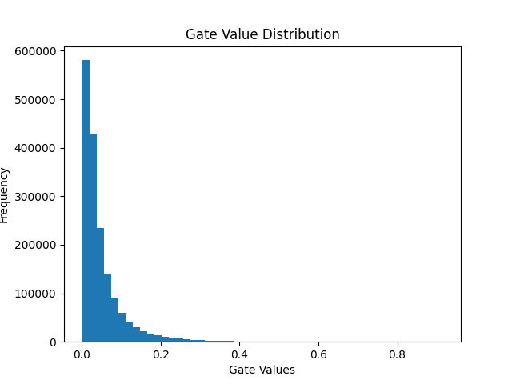

# Self-Pruning Neural Network

A neural network that learns to prune itself during training using learnable gate parameters and L1 sparsity regularization, implemented on CIFAR-10.

Built as part of the **Tredence AI Engineering Internship Case Study**.

---

## How It Works

Each weight in the network has a learnable gate score. A sigmoid function converts it to a value between 0 and 1:

$$W_{pruned} = W \cdot \sigma(G)$$

- Gate ≈ 0 → weight is pruned (removed)
- Gate ≈ 1 → weight remains active

A sparsity loss (L1 penalty on gate values) is added to the training loss to encourage gates to go to zero, resulting in a sparse and efficient network.

---

## Project Structure

```
self-pruning-neural-network/
├── main.py
├── report.md
├── README.md
└── results/
    ├── gate_distribution.png
    ├── best_model.pth
    └── results.txt
```

---

## Results

| Lambda | Test Accuracy (%) | Sparsity (%) |
|--------|-------------------|--------------|
| 0.01   | 52.93             | 57.22        |
| 0.1    | 50.86             | 88.00        |
| 1.0    | 44.62             | 99.46        |

**Best Model: λ = 0.1** — best balance between sparsity and accuracy.

---

## Gate Distribution

The gate distribution of the best model shows:
- A strong spike near **0** → many weights successfully pruned
- A smaller cluster away from 0 → important connections retained



---

## Run

**Install dependencies:**
```bash
pip install torch torchvision matplotlib numpy
```

**Train the model:**
```bash
python main.py
```

CIFAR-10 dataset will be downloaded automatically. Results will be saved in the `results/` folder.

---

## Tech Stack

- Python 3.x
- PyTorch
- torchvision
- matplotlib
- numpy

---

## Key Concepts

- **Learnable Pruning** — gates are trained alongside weights, no post-training pruning needed
- **L1 Sparsity Loss** — encourages gates to go to exactly zero
- **Lambda Tuning** — controls the sparsity vs accuracy tradeoff
